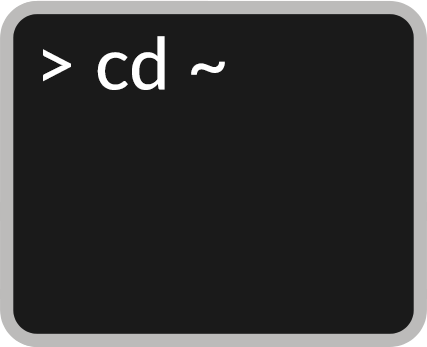

<p align="center">
  
  <br/><a href="https://cocoapods.org/pods/UNIXFileSystem">
  
  
  
  
  <br/>
  
  
  <br/>
  
  
  
  </a>
</p>

***

# What's this?

`UNIXFileSystem` (aka `UFS`) is an UNIX file system manager for iOS/macOS/tvOS/watchOS platforms.

## Requirements

* iOS 8.0+
* macOS 10.10+
* watchOS 2.0+
* tvOS 9.0+
* Xcode 9 with Swift 5

## Installation

#### CocoaPods

```ruby
platform :ios, '8.0'

target 'YOUAR_TARGET_NAME' do
  use_frameworks!

  pod 'UNIXFileSystem'
end
```

## Types

The main Types in `UNIXFileSystem` are listed below with _protocols being emphasized_:

- UFSPath
- UFSRegularFile
- UFSSymbolicLink
- UFSAliasFile
- UFSDirectory
- UFSVolume
- _UFSPathRepresentable_
- _UFSParent_
- _UFSSubitem_
- _UFSCopyable_
- _UFSCopyableSubitem_
- _UFSMoveable_
- _UFSMoveableSubitem_
- _UFSRenameable_
- _UFSRemovable_
- _UFSTrashable_
- _UFSLinkable_
- _UFSSymbolicLinkable_
- _UFSAliasable_
- _UFSFileHandleConvertible_
- _UFSFileWrapperConvertible_
- _UFSItem_
- _UFSFile_

## Contribution

You are welcome to fork and submit pull requests.

## License

UFS is open-sourced software, licensed under the `MIT` license.
